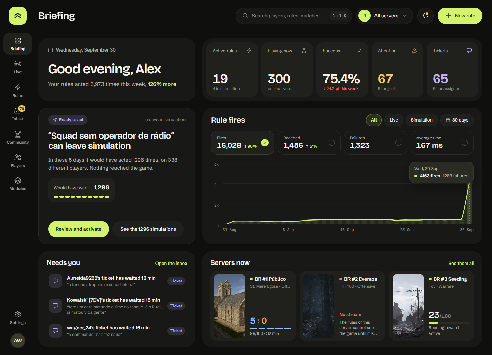
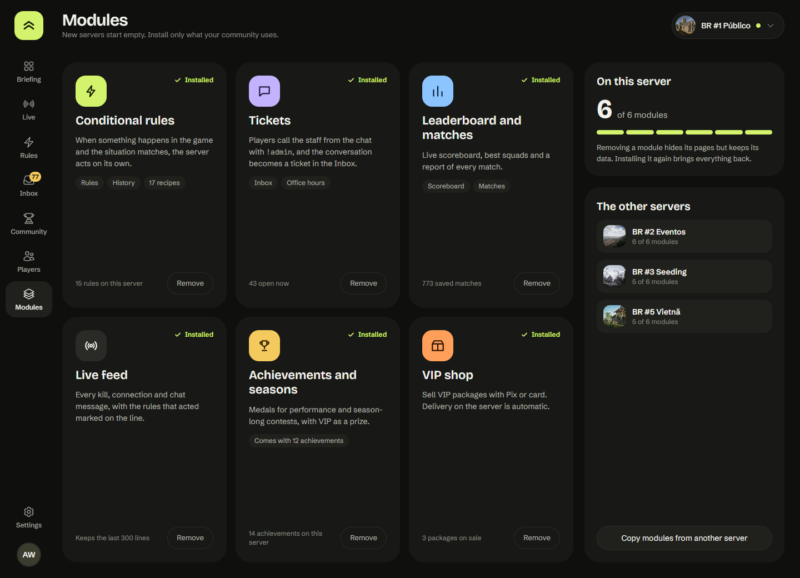
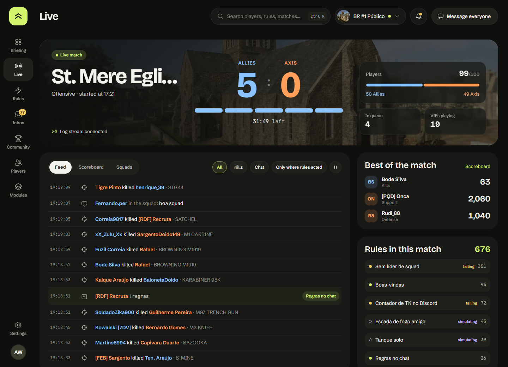
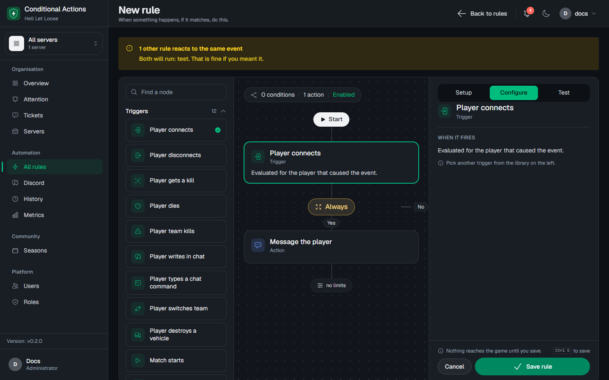
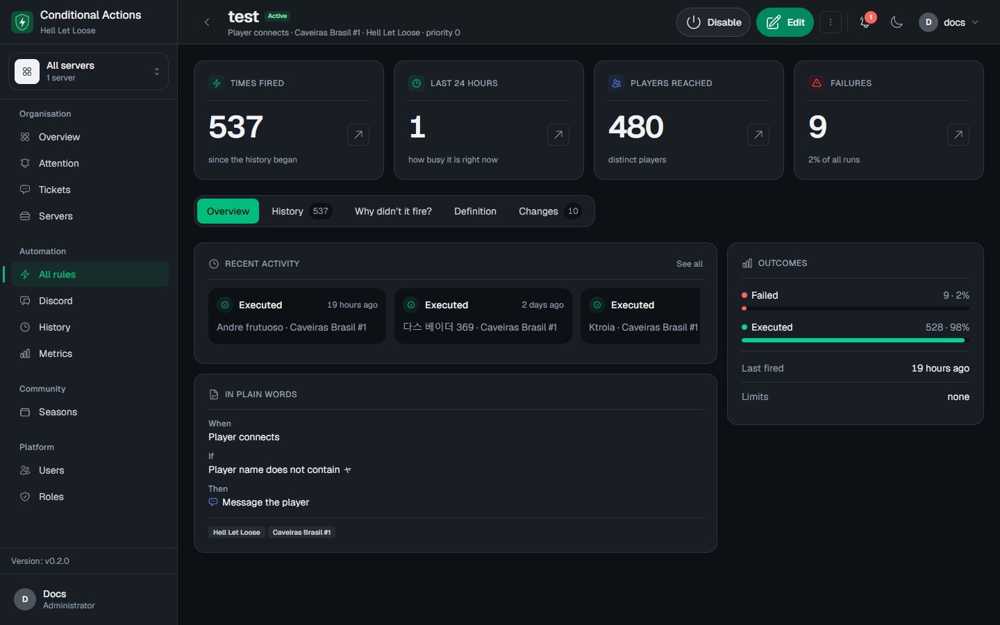
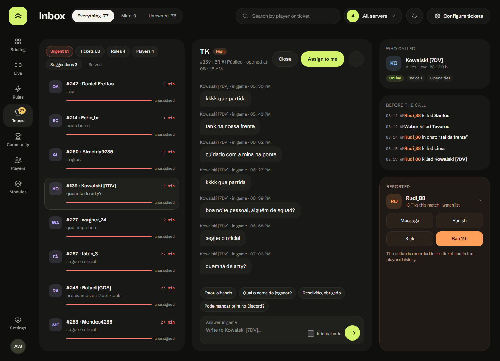
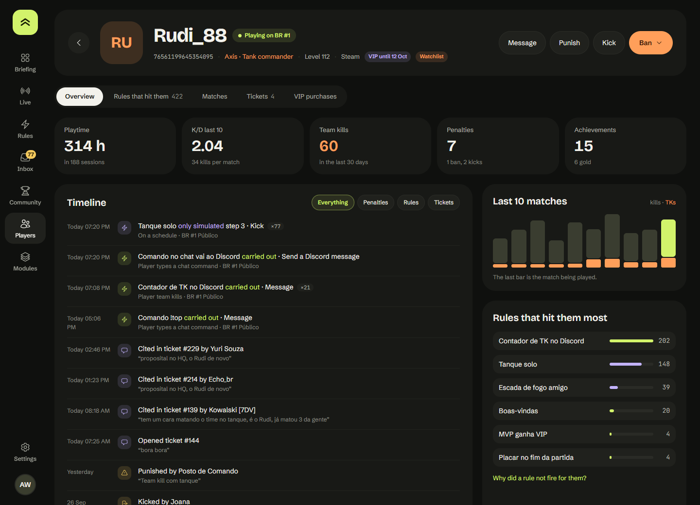
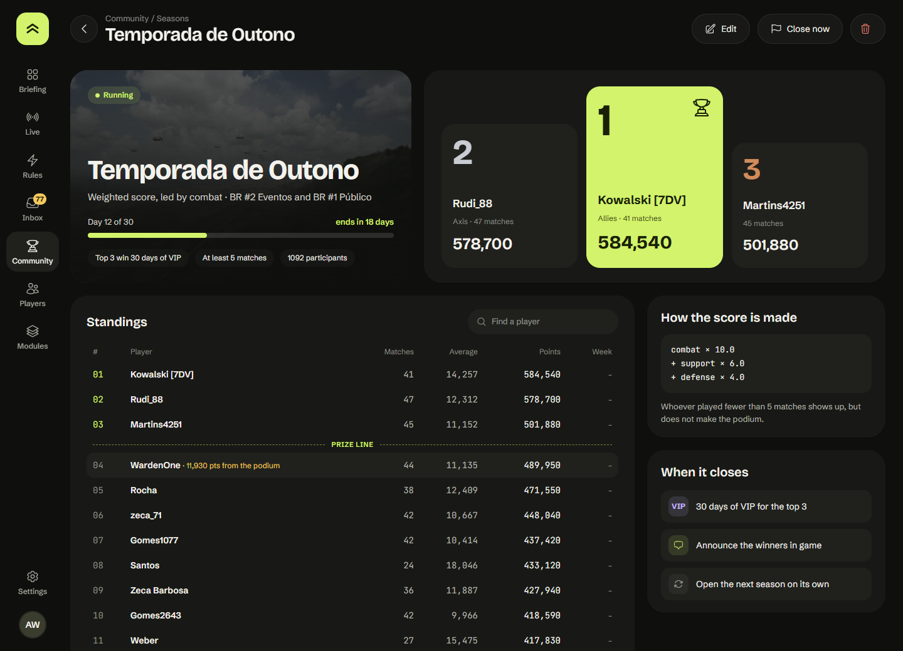
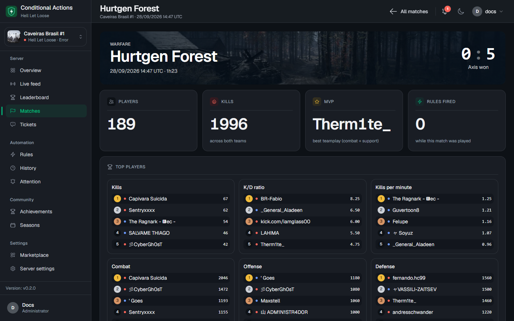

# HLL Conditional Actions

Rule automation for [Hell Let Loose](https://www.hellletloose.com/) servers, built on top of [CRCON](https://github.com/MarechJ/hll_rcon_tool).


  




*When **TRIGGER** happens, if **CONDITIONS** hold, run **ACTIONS**.* Welcome new players, warn team killers, escalate on repeat offenders, reward the people who seed, or post to Discord when something needs a human. Next to the rules: player support tickets from the in-game chat, achievements and seasons, leaderboards and match history.

No scripting. A rule is built from dropdowns and reads back as a sentence. The builder is a test bench: it overlays the last real runs on your edit and replays the draft over the last week of events before you publish — and a new rule starts in simulation, recording everything it *would* have done without touching the game, until it has run clean for three days.

> [!IMPORTANT]
> **This app does not talk to Hell Let Loose. It talks to CRCON.**
> You need a working [CRCON](https://github.com/MarechJ/hll_rcon_tool) installation first: it is what holds the RCON connection, parses the game logs and exposes both as an API. Without one there is nothing for this app to read from or act on.

## Features

Everything beyond the core is a **module** each server installs from its **Modules** page. A new server starts with none; turn on only what your community uses.

| Module | What it adds |
| --- | --- |
| **Conditional rules** | *When* something happens, *if* it matches, *then* act: messages, punishments, kicks, bans, broadcasts, Discord posts. Simulation, a "why didn't it fire?" diagnosis, drafts and version history included. |
| **Tickets** | Players call an admin from the in-game chat; admins answer, assign and close tickets from the browser. |
| **Achievements and seasons** | Goals players unlock by playing, and ranked seasons that reward the best with VIP. |
| **Leaderboard and matches** | The live top players and squads, and the scoreboard of every past match. |
| **Live feed** | Kills, chat and connections as they happen, each line with the rules it fired. |
| **VIP shop** | A public storefront where players buy VIP, paid with Stripe, Dodo Payments or Mercado Pago, delivered to every server of the package. |

Always there: the Briefing, each server's live cockpit, one Inbox for attention items and tickets, the players directory, Ctrl K search, notifications, Discord webhooks, engine metrics, users, roles and two factor — on desktop, tablet and phone, in a dark or light theme.



## Documentation

<table>
  <tbody>
    <tr>
      <th>Getting started</th>
      <th>User guide</th>
      <th>Running it</th>
      <th>For the devs</th>
      <th>Help</th>
    </tr>
    <tr>
      <td valign="top" nowrap>
        ● <a href="https://github.com/fxsobr/hll_conditional_actions/wiki/Getting-Started-%E2%80%90-What-it-does">What it does</a><br />
        ● <a href="https://github.com/fxsobr/hll_conditional_actions/wiki/Getting-Started-%E2%80%90-Requirements">Requirements</a><br />
        ● <a href="https://github.com/fxsobr/hll_conditional_actions/wiki/Getting-Started-%E2%80%90-Installation">Installation</a>
      </td>
      <td valign="top" nowrap>
        ● <a href="https://github.com/fxsobr/hll_conditional_actions/wiki/User-Guide-%E2%80%90-Connecting-a-CRCON-server">Connecting a server</a><br />
        ● <a href="https://github.com/fxsobr/hll_conditional_actions/wiki/User-Guide-%E2%80%90-Writing-rules">Writing rules</a><br />
        ● <a href="https://github.com/fxsobr/hll_conditional_actions/wiki/User-Guide-%E2%80%90-Rules-%E2%80%90-Triggers">When — triggers</a><br />
        ● <a href="https://github.com/fxsobr/hll_conditional_actions/wiki/User-Guide-%E2%80%90-Rules-%E2%80%90-Conditions">If — conditions</a><br />
        ● <a href="https://github.com/fxsobr/hll_conditional_actions/wiki/User-Guide-%E2%80%90-Rules-%E2%80%90-Operators">Operators</a><br />
        ● <a href="https://github.com/fxsobr/hll_conditional_actions/wiki/User-Guide-%E2%80%90-Rules-%E2%80%90-Actions">Then — actions</a><br />
        ● <a href="https://github.com/fxsobr/hll_conditional_actions/wiki/User-Guide-%E2%80%90-Features"><strong>Features</strong></a><br />
        &nbsp;&nbsp;&nbsp;○ <a href="https://github.com/fxsobr/hll_conditional_actions/wiki/User-Guide-%E2%80%90-Features-%E2%80%90-Tickets">Tickets</a><br />
        &nbsp;&nbsp;&nbsp;○ <a href="https://github.com/fxsobr/hll_conditional_actions/wiki/User-Guide-%E2%80%90-Features-%E2%80%90-Achievements-and-seasons">Achievements and seasons</a><br />
        &nbsp;&nbsp;&nbsp;○ <a href="https://github.com/fxsobr/hll_conditional_actions/wiki/User-Guide-%E2%80%90-Features-%E2%80%90-Leaderboard-and-matches">Leaderboard and matches</a><br />
        &nbsp;&nbsp;&nbsp;○ <a href="https://github.com/fxsobr/hll_conditional_actions/wiki/User-Guide-%E2%80%90-Features-%E2%80%90-Live-feed">Live feed</a><br />
        &nbsp;&nbsp;&nbsp;○ <a href="https://github.com/fxsobr/hll_conditional_actions/wiki/User-Guide-%E2%80%90-Features-%E2%80%90-Discord">Discord</a><br />
        &nbsp;&nbsp;&nbsp;○ <a href="https://github.com/fxsobr/hll_conditional_actions/wiki/User-Guide-%E2%80%90-Features-%E2%80%90-Attention-and-history">Attention and history</a><br />
        &nbsp;&nbsp;&nbsp;○ <a href="https://github.com/fxsobr/hll_conditional_actions/wiki/User-Guide-%E2%80%90-Features-%E2%80%90-Testing-rules">Testing rules</a><br />
        ● <a href="https://github.com/fxsobr/hll_conditional_actions/wiki/User-Guide-%E2%80%90-Users-roles-and-two-factor">Users and two factor</a>
      </td>
      <td valign="top" nowrap>
        ● <a href="https://github.com/fxsobr/hll_conditional_actions/wiki/Administration-%E2%80%90-Production-deployment">Production deployment</a><br />
        ● <a href="https://github.com/fxsobr/hll_conditional_actions/wiki/Administration-%E2%80%90-Configuration">Configuration</a><br />
        ● <a href="https://github.com/fxsobr/hll_conditional_actions/wiki/Administration-%E2%80%90-Security">Security</a><br />
        ● <a href="https://github.com/fxsobr/hll_conditional_actions/wiki/Administration-%E2%80%90-Backups">Backups</a><br />
        ● <a href="https://github.com/fxsobr/hll_conditional_actions/wiki/Administration-%E2%80%90-Commands">Commands</a>
      </td>
      <td valign="top" nowrap>
        ● <a href="https://github.com/fxsobr/hll_conditional_actions/wiki/Developer-Guides-%E2%80%90-Architecture">Architecture</a><br />
        ● <a href="https://github.com/fxsobr/hll_conditional_actions/wiki/Developer-Guides-%E2%80%90-Development-environment">Development environment</a><br />
        ● <a href="https://github.com/fxsobr/hll_conditional_actions/wiki/Developer-Guides-%E2%80%90-Translations">Translations</a>
      </td>
      <td valign="top" nowrap>
        ● <a href="https://github.com/fxsobr/hll_conditional_actions/wiki/Troubleshooting-%E2%80%90-Common-issues">Common issues</a><br />
        ● <a href="https://github.com/fxsobr/hll_conditional_actions/issues">Report an issue</a>
      </td>
    </tr>
  </tbody>
</table>

## Quick start

```bash
git clone git@github.com:fxsobr/hll_conditional_actions.git
cd hll_conditional_actions
cp .env.example .env          # fill in PHX_HOST, SECRET_KEY_BASE, ENCRYPTION_KEY, POSTGRES_PASSWORD
docker compose pull
docker compose up -d
```

It answers on `http://<your machine>:4000`, leaving ports 80 and 443 alone. Sign in with `admin` / `admin` and you are asked to pick a new password immediately.

Every command for running, upgrading and backing it up: [Commands](https://github.com/fxsobr/hll_conditional_actions/wiki/Administration-%E2%80%90-Commands).

Full walkthrough: [Installation](https://github.com/fxsobr/hll_conditional_actions/wiki/Getting-Started-%E2%80%90-Installation).

## Screenshots

**The Briefing** — what needs you, the rule ready to leave simulation, and every server right now.


**Live** — the match over the map, and the feed with the rules each line fired.



**The rule builder** — the rule as a sentence, conditions in groups, the last runs overlaid and a 7-day replay of the draft.



**A rule's own page** — ready to act for real or not, the escalation ladder with its counts, runs, and every version.



**The Inbox** — attention items and player tickets in one list, with the conversation and the reported player.



**A player** — the last matches, the rules that hit them, their tickets, and what you can do about them.



**A season** — the podium, the standings and who moved this week.



**A match** — the result, the MVP and the best players of every category.



## Thanks to CRCON

This project stands entirely on **[CRCON — Hell Let Loose Community RCON](https://github.com/MarechJ/hll_rcon_tool)**, by [MarechJ](https://github.com/MarechJ) and its contributors.

CRCON does the hard part — holding the RCON connection, parsing the game's logs into structured events, and putting a sane API in front of both. It is the reason this app can be a rule engine instead of a reimplementation of everything underneath. The recipes that ship here are modelled on CRCON's own automods, and its permission model is the one this app asks for and respects.

If you run a Hell Let Loose server, go and use CRCON. It is excellent.

- **GitHub:** <https://github.com/MarechJ/hll_rcon_tool>
- **Discord:** <https://discord.com/invite/zpSQQef>

## Contribute

Any contribution is welcome — code, documentation, or a translation.

The interface goes through gettext and ships in **English**, **Brazilian Portuguese** and **Spanish**. Adding a language does not require knowing Elixir; see [Translations](https://github.com/fxsobr/hll_conditional_actions/wiki/Developer-Guides-%E2%80%90-Translations).

Hell Let Loose is a trademark of Team17 / Expression Games. This is an unofficial community tool, not affiliated with either.
